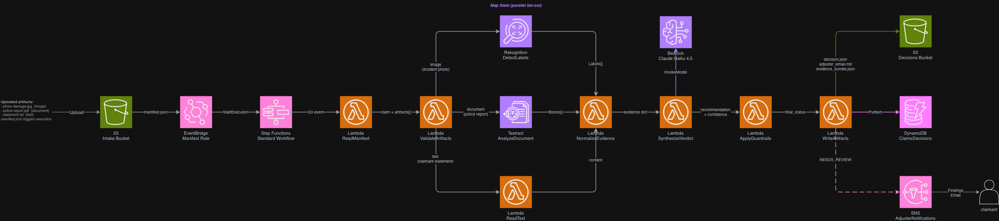

# insurance-claims-ai-pipeline

Event-driven AI pipeline for insurance claim adjudication using AWS Step Functions,
Rekognition, Textract, Comprehend, and Bedrock. Designed as a full-lab portfolio
project for AWS Cloud Architect students.

## Architecture

[](architecture.png)

## What it does

An S3 manifest upload triggers a Step Functions Standard workflow that:

1. Reads and validates the claim manifest
2. Validates all declared artifacts are present (HeadObject Map -- fails fast on missing files)
3. Fans out per-artifact in parallel (Rekognition for images, Textract for documents,
   Comprehend sentiment + key phrases for text statements)
4. Calls Bedrock Claude Haiku to synthesize an adjudication recommendation with
   confidence score, reasoning, and dual output: a claimant-safe letter and an
   internal adjuster brief
5. Applies deterministic guardrails via ASL Choice state: low-confidence verdicts
   are downgraded to NEEDS_REVIEW regardless of original recommendation
6. Routes outcomes to three distinct paths:
   - APPROVE -- SES email to claimant with approval letter
   - DENY -- SES email to claimant with denial reasons and appeal rights
   - NEEDS_REVIEW -- SNS notification to adjuster with internal brief
7. Persists four output files to S3 and writes a DynamoDB record

## Prerequisites

- AWS account with Bedrock model access granted for Claude Haiku 4.5
- AWS CLI v2
- SES-verified sender and recipient email addresses (sandbox mode)

See `guide.md S0` for full prerequisites and cost guardrails.

## Quick start

All Lambda code is embedded inline in `cfn/template.yaml`. No build step required.

```bash
# Create a staging bucket for the CFN template (> 51 KB inline limit)
ACCOUNT=$(aws sts get-caller-identity --query Account --output text)
aws s3 mb s3://cfn-templates-${ACCOUNT} --region us-east-1

# Deploy the stack
aws cloudformation deploy \
  --template-file cfn/template.yaml \
  --stack-name insurance-claims-ai-pipeline \
  --s3-bucket cfn-templates-${ACCOUNT} \
  --capabilities CAPABILITY_NAMED_IAM \
  --region us-east-1 \
  --parameter-overrides \
      BedrockModelId=us.anthropic.claude-haiku-4-5-20251001-v1:0 \
      SenderEmail=you@example.com \
      ClaimantEmail=you@example.com \
      AdjusterEmail=you@example.com

# Get the intake bucket name
INTAKE=$(aws cloudformation describe-stacks \
  --stack-name insurance-claims-ai-pipeline \
  --query 'Stacks[0].Outputs[?OutputKey==`IntakeBucketName`].OutputValue' \
  --output text)

# Seed the APPROVE sample (artifacts first, manifest last to trigger the pipeline)
aws s3 cp samples/approve/ s3://${INTAKE}/clients/acme-corp/CLM-001/ --recursive --exclude "manifest.json"
aws s3 cp samples/approve/manifest.json s3://${INTAKE}/clients/acme-corp/CLM-001/manifest.json
```

See `guide.md S5` for the NEEDS_REVIEW guardrail demo, `guide.md S6` for the DENY
path, and `guide.md S12` for teardown.

## Three sample claim sets

| Directory | Claim | Expected outcome | Scenario |
|---|---|---|---|
| `samples/approve/` | CLM-001 | APPROVE (0.92) | Vehicle collision, consistent evidence |
| `samples/red-flag/` | CLM-002 | NEEDS_REVIEW (0.45) | Conflicting signals, adjuster escalation |
| `samples/deny/` | CLM-003 | DENY (0.95) | Bicycle claimed under auto policy |

## Repository layout

```
cfn/
  template.yaml              single self-contained CloudFormation stack
                             (all Lambda code embedded inline via Code.ZipFile)
app/
  lambdas/
    read_manifest/           validates S3 EventBridge event + manifest schema
    read_text/               reads text artifacts from S3 + Comprehend analysis
    synthesize_verdict/      calls Bedrock Claude, parses structured JSON output
    write_artifacts/         writes decision.json, client_letter.txt,
                             adjuster_brief.md, evidence_bundle.json + DynamoDB
  sfn/
    state_machine.asl.json   Step Functions ASL definition
samples/
  approve/                   CLM-001: normal vehicle collision (APPROVE)
  red-flag/                  CLM-002: conflicting evidence (NEEDS_REVIEW)
  deny/                      CLM-003: excluded peril (DENY)
  README.md                  sample file provenance and license notes
guide.md                     full lab guide S0-S18 + Appendices A-E
architecture.drawio
architecture.png
```

## Estimated cost per run

~$0.07 per claim (dominated by Textract ~$0.065/page). See guide.md Appendix A for
a full breakdown. Set a billing alarm before running.

## Lab guide

See [guide.md](guide.md) for step-by-step instructions, architecture walkthrough,
IAM deep-dive, observability, and extension exercises.

## License

MIT -- see LICENSE
